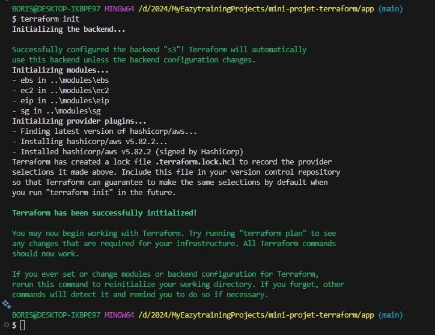

# MINI-PROJET-TERRAFORM : DÉPLOYEZ UNE INFRA COMPLÈTE

## INFORMATIONS A PROPOS DE L'AUTEUR

Session           : Bootcamp DevOps N°15

Period            : September - November

First & Last Name : Kossi GBENOU

LinkedIn          : https://www.linkedin.com/in/gkossi/

<!--
## ENONCE


-->

#


L'énoncé du présent projet se présente comme suit :

> ![00 :: Enoncé du projet] 

<!--
	URL Encode online
	https://www.urlencoder.io/ 
-->
#


Pour réaliser ce projet, il faut tout d'abord identifier les prérequis et aussi construire un worklow. Cette étape est illustrée sur l'image suivante  :

> ![01 :: PREREQUIS & WORKFLOW] 
<!--div align="center">
	<p>
<a href="https://www.terraform.io/" target="_blank"></a>
<a href="https://aws.amazon.com/fr/" target="_blank"></a>
</p>
</div-->

#


Dans la réalisation de tout projet, il est nécessaire d'adopter une méthologie à laquelle il est aussi important d'associer des bonnes pratiques. Dans le cadre de ce projet, voici notre méthodologie ainsi que les bonnes pratiques associées :

1. Nous allons stocker le state file de l'infra sur un remote backend (S3) ;
2. Nous allons utiliser un compte IAM avec les droits Admin sur AWS ;
3. Nous allons fournir les paramètres (***ACCESS KEY*** et ***SECRET KEY***) d'accès au compte à partir du paramètre ***shared_credentials_files*** ;
3. Nous allons fournir la paire de clé (***PRIVATE_KEY***) permettant de se connecter à l'infra à partir du protocole SSH en utilisant la fonction ***file*** ;
4. Les dossiers du projet seront organisés de la facon suivantes :
	- Le dossier **modules**: comme son nom l'indique, c'est lui qui va contenir nos différents modules (EC2, EBS, EIP, SG) ;
	- Le dossier **app**: va représenter notre principale infra à provisionner. Il va contenir le manifest principal où seront appelés nos différents modules ;
	- Le dossier **images**: va servir à stocker les différentes catpures d'écran des réalisations;
	- Le fichier **.gitignore**: va contenir les infos sur les répertoires et fichiers à ignorer lors du Push du projet sur notre SCM;
	- Le fichier **infos_ec2.txt**: va servir à enregistrer certaines infos utiles de notre infra comme : PUBLIC IP, ID et AZ.

#


1. Etape N°1 : Pour commencer, nous allons d'abord créer le bucket S3 ;
2. Etape N°2 : Créer les différents modules (EC2, EBS, EIP, SG) qui vont permettre de provisionner une infra complète. Pour se faire, nous allons procéder comme suit :
	- Créer un répertoire nommé ***modules*** à la racine du projet et y créer à l'intérieur un sous-répertoire pour chacun des module ***ec2***, ***ebs***, ***eip*** et ***sg*** qui vont contenir les fichiers manifests ;
	- Créer dans chacun des sous-répertoires les fichiers suivants :

	```bash
	├── ebs                ├── sg                 ├── eip                ├── ec2
	│   ├── main.tf        │   ├── main.tf        │   ├── main.tf        │   ├── main.tf
	│   ├── outputs.tf     │   ├── outputs.tf     │   ├── outputs.tf     │   ├── outputs.tf
	│   └── variables.tf   │   └── variables.tf   │   └── variables.tf   │   └── variables.tf
	```

	- ***variables.tf*** : va servir à variabiliser les éléments nécessaires notamment le type d'instance, le tag et le groupe de securité ;
	- ***main.tf*** : va contenir l'ensemble des éléments non sensibles notamment le data source, l'instance EC2, le volume EBS, le groupe de sécurité et l'adresse ip publique ;
	- ***outputs.tf*** : va servir à rendre accessibles certaines valeurs à utiliser par d'autres modules
3. Etape N°3 : Créer l'environnement (APP) à provisionner :
	- Créer un répertoire nommé ***app*** à la racine du projet qui va contenir les fichiers manifests ;
	- Créer à l'intérieur du répertoire ***app***, un fichier ***main.tf*** qui va contenir l'ensemble des éléments sensibles (le provider aws et le backend S3) et non sensibles (l'appel du module EC2).

#


### Etape N°1 : Création du bucket S3
Comme prévu dans notre plan de travail, on va commencer par créer le buckect S3 qui va servir à stocker le state file de notre projet.

```bash
Amazon S3 -> Create bucket
```

> ![Création du bucket S3] 

> ![Création du bucket S3 (Suite)] 

### Etape N°2 : Création des modules
<!--div>
Création des dossiers et fichiers :
mkdir -p mini-projet-terraform && cd mini-projet-terraform 
mkdir -p app modules/{ec2,eip,ebs,sg}
</div-->

#
1. **Module EBS :**
#
Ce module permet de déployer un volume EBS à associer à notre machine virtuelle EC2.
Le contenu des trois (03) fichiers de ce module se présentent comme suit :

- Le fichier ***variables.tf*** :

```bash
variable "ebs_az" {
  description = "La zone de disponibilité de l'EBS"
  type        = string
  default     = "us-east-1a"
}

variable "ebs_common_tag" {
  description = "Le tag sur le volume EBS"
  type = map(string)
  default = {
    Name = "ebs-mini-projet-terraform"
  }
}

variable "ebs_size" {
  description = "La taille du volume EBS en GB"
  type        = number
  default     = 10
}
```

- Le fichier ***main.tf*** :

```bash
# Définition du volume EBS
resource "aws_ebs_volume" "myebs" {
  availability_zone = var.ebs_az
  tags              = var.ebs_common_tag
  size              = var.ebs_size
}
```

- Le fichier ***outputs.tf*** :

```bash
output "ebs_id_output" {
  description = "L'ID du volume EBS"
  value = aws_ebs_volume.myebs.id
}
```


#
2. **Module SG :**
#
Ce module permet de créer un groupe de sécurité et de l'associer à notre VM EC2.
Le contenu des trois (03) fichiers de ce module se présentent comme suit :

- Le fichier ***variables.tf*** :

```bash
variable "sg_name" {
  description = "Le nom du groupe de sécurité"
  type        = string
  default     = "mpt-allow-http-https-ssh"
}

variable "sg_common_tag" {
  description = "Le tag sur le groupe de sécurité"
  type        = map(string)
  default = {
    Name  = "sg-mini-projet-terraform"
  }
}

variable "ingress_allowed_ipv4_cidrs" {
  description = "Liste des blocs CIDR ipv4 autorisés à accéder à la VM"
  type        = list(string)
  default     = ["0.0.0.0/0"]
}

variable "ingress_allowed_ipv6_cidrs" {
  description = "Liste des blocs CIDR ipv6 autorisés à accéder à la VM"
  type        = list(string)
  default     = ["::/0"]
}

variable "egress_allowed_ipv4_cidrs" {
  description = "Liste des blocs CIDR ipv4 auxquels la VM pourra accéder"
  type        = list(string)
  default     = ["0.0.0.0/0"]
}

variable "egress_allowed_ipv6_cidrs" {
  description = "Liste des blocs CIDR ipv6 auxquels la VM pourra accéder"
  type        = list(string)
  default     = ["::/0"]
}
```

- Le fichier ***main.tf*** :

```bash
# Définition du groupe de sécurité à appliquer à notre infrastructure
resource "aws_security_group" "mysg" {
  description = "Autorisation des trafiques entrants et sortants"
  name        = var.sg_name
  tags        = var.sg_common_tag

  # Règle pour autoriser le trafic entrant en HTTPS (port 443)
  ingress {
    description = "TLS from VPC"
    from_port   = 443
    to_port     = 443
    protocol    = "tcp"
    cidr_blocks = var.ingress_allowed_ipv4_cidrs
    ipv6_cidr_blocks = var.ingress_allowed_ipv6_cidrs
  }

  # Règle pour autoriser le trafic entrant en HTTP (port 80)
  ingress {
    description = "http from VPC"
    from_port   = 80
    to_port     = 80
    protocol    = "tcp"
    cidr_blocks = var.ingress_allowed_ipv4_cidrs
    ipv6_cidr_blocks = var.ingress_allowed_ipv6_cidrs
  }

  # Règle pour autoriser le trafic entrant en SSH (port 22)
  ingress {
    description = "ssh from VPC"
    from_port   = 22
    to_port     = 22
    protocol    = "tcp"
    cidr_blocks = var.ingress_allowed_ipv4_cidrs
    ipv6_cidr_blocks = var.ingress_allowed_ipv6_cidrs
  }

  # Règle pour autoriser tout type de trafic sortant de la VM
  egress {
    from_port   = 0
    to_port     = 0
    protocol    = "-1"
    cidr_blocks = var.egress_allowed_ipv4_cidrs
    ipv6_cidr_blocks = var.ingress_allowed_ipv6_cidrs
  }
}
```

- Le fichier ***outputs.tf*** :

```bash
output "sg_name_output" {
  description = "Le nom du groupe de sécurité"
  value = aws_security_group.mysg.name
}
```

#
3. **Module EIP :**
#
Ce module permet d'obtenir dynamiquement une adresse ip publique statique et de l'associer à notre machine virtuelle EC2.
Le contenu des trois (03) fichiers de ce module se présentent comme suit :

- Le fichier ***variables.tf*** :

```bash
variable "eip_common_tag" {
  description = "Le tag sur l'eip de l'instance ec2"
  type = map(string)
  default = {
    Name = "eip_mini_projet_terraform"
  }
}
```

- Le fichier ***main.tf*** :

```bash
# Définition de l'adresse ip publique de notre VM EC2
resource "aws_eip" "myeip" {
  domain   = "vpc"
  tags = var.eip_common_tag
}
```

- Le fichier ***outputs.tf*** :

```bash
output "eip_id_output" {
  description = "L'ID de l'EIP"
  value = aws_eip.myeip.id
}

output "eip_public_ip_output" {
  description = "L'address IP Public"
  value = aws_eip.myeip.public_ip
}
```

#
4. **Module EC2 :**
#
Ce module permet de déployer une machine virtuelle EC2.
Le contenu des trois (03) fichiers de ce module se présentent comme suit :

- Le fichier ***variables.tf*** :

```bash
variable "ec2_instance_type" {
  description = "Le type d'instance EC2"
  type        = string
  default     = "t2.micro"
}

variable "ec2_common_tag" {
  description = "Le tag sur l'instance EC2"
  type = map(string)
  default = {
    Name = "ec2-mini-projet-terraform"
  }
}

variable "ec2_key_name" {
  description = "Nom de la paire de clés pour l'accès SSH à l'instance EC2"
  type    = string
  default = "expertdevops"
}

variable "ec2_az" {
  description = "La zone de disponibilité où l'instance sera créée"
  type        = string
  default = "us-east-1a"
}

variable "ec2_sg" {
  description = "Liste des groupes de sécurité à associer à l'instance EC2"
  type        = string
  default     = "mini-projet-terraform-sg"
}

variable "ec2_user" {
  description = "L'utilisateur configuré pour l'instance EC2"
  type = string
  default = "ubuntu"
}

variable "ec2_public_ip" {
  description = "L'adresse ip publique de l'instance EC2"
  type = string
  default = "0.0.0.0"
}
```

- Le fichier ***main.tf*** :

```bash
# Obtenir dynamiquement la dernière version de ubuntu bionic
data "aws_ami" "ubuntu_bionic" {
  most_recent = true
  owners      = ["099720109477"] # ID du propriétaire officiel des AMIs Ubuntu dans AWS

  filter {
    name   = "name"
    values = ["ubuntu/images/hvm-ssd/ubuntu-bionic-18.04-amd64-server-*"]
  }
  filter {
    name   = "virtualization-type"
    values = ["hvm"]
  }
}

# Définition de l'instance EC2 à déployer
resource "aws_instance" "myec2" {
  ami             = data.aws_ami.ubuntu_bionic.id
  instance_type   = var.ec2_instance_type
  availability_zone = var.ec2_az
  tags            = var.ec2_common_tag
  key_name        = var.ec2_key_name
  security_groups = ["${var.ec2_sg}"]

  # Connexion à la VM et installation de nginx
  provisioner "remote-exec" {
    inline = [
      "sudo apt update -y",
      "sudo apt install -y nginx",
      "sudo systemctl enable nginx",
      "sudo systemctl start nginx",
      "echo '<center><h1>Hello Eazytraining !!!</h1><h2>Bienvenue dans le Mini-Projet Terraform réalisé par Kossi GBENOU !</h2></center>' | sudo tee /usr/share/nginx/html/index.html > /dev/null"
    ]

    connection {
      type        = "ssh"
      user        = var.ec2_user
      private_key = file("C:/Users/BORIS/Downloads/${var.ec2_key_name}.pem")
      host        = self.public_ip
    }
  }

  # Enregistrement des informations (ip publique, ID et AZ) de la VM dans un fichier en local sur mon PC
  provisioner "local-exec" {
    #command = "echo PUBLIC IP: ${var.ec2_public_ip}; ID: ${aws_instance.myec2.id}; AZ: ${aws_instance.myec2.availability_zone} >> infos_ec2.txt"
    command = "echo PUBLIC IP: ${self.public_ip} >> infos_ec2.txt"
  }

  # Supression automatique des volumes supplémentaires associés à notre VM
  root_block_device {
    delete_on_termination = true
  }

}
```

- Le fichier ***outputs.tf*** :

```bash
output "ec2_id_output" {
  description = "L'ID de la VM EC2 créée"
  value = aws_instance.myec2.id
}

output "ec2_az_output" {
  description = "La zone de disponiblité de la VM EC2 créée"
  value = aws_instance.myec2.availability_zone
}
```

### Etape N°3 : Création de l'environnement (APP) à provisionner : Utilisation des modules

Ici, il s'agira de la mise en place de notre infra principale.
Comme décrit précédemment, nous allons créer un répertoire nommé ***app*** à la racine du projet qui va contenir les fichiers manifests (***variables.tf*** et ***main.tf***) ainsi que le fichier ***infos_ec2.txt***.
Le contenu des fichiers se présente comme suit :

- Le fichier ***variables.tf*** :

Ce fichier contient l'ensemble des éléments variabilisés (**region, credentials**).

```bash
variable "aws_region" {
  type        = string
  default     = "us-east-1"
  description = "La région de travail dans le cloud AWS"
}

variable "aws_credentials" {
  type        = string
  default     = "C:/Users/BORIS/Downloads/aws_credentials"
  description = "Le fichier contenant les credentials"
}
```

- Le fichier ***main.tf*** :

Il va contenir l'ensemble des éléments sensibles (le provider aws et le backend S3) et non sensibles (l'appel du module EC2).

```bash
# Configuration du Provider AWS
provider "aws" {
  region                   = var.aws_region
  shared_credentials_files = ["${var.aws_credentials}"]
}

# Configuration du backend s3
terraform {
  backend "s3" {
    bucket                   = "mini-projet-terraform-backend"
    key                      = "mini-projet-terraform.tfstate"
    region                   = "us-east-1"
    shared_credentials_files = ["C:/Users/BORIS/Downloads/aws_credentials"]
  }
}

# Création du volume EBS : Appel du module ebs
module "ebs" {
  source = "../modules/ebs"
}

# Création du groupe de sécurité : Appel du module sg
module "sg" {
  source = "../modules/sg"
}

# Création de l'EIP : Appel du module eip
module "eip" {
  source = "../modules/eip"
}

# Création de la VM : Appel du module ec2
module "ec2" {
  # Définition de la source du module EC2
  source = "../modules/ec2"
  ec2_sg = module.sg.sg_name_output
}

# Création de la ressource pour attacher le volume EBS à la VM
resource "aws_volume_attachment" "myebs_attachement" {
  device_name = "/dev/sdb"
  volume_id   = module.ebs.ebs_id_output
  instance_id = module.ec2.ec2_id_output
}

# Création de la ressource pour attacher l'EIP' à la VM
resource "aws_eip_association" "myeip_association" {
  allocation_id = module.eip.eip_id_output
  instance_id   = module.ec2.ec2_id_output
}
```

- Le fichier ***infos_ec2.txt*** :

Ce fichier va servir à enregistrer les informations de la VM après son déploiement.

### Etape N°4 : Déploiement de l'infrastructure

1. **Initialisation et validation de la configuration**

Pour démarrer le déploiement, nous allons commencer par l'initilisation qui va nous permettre de télécharger les plugins du provider AWS et aussi charger nos 4 modules (EBS, SG, EIP et EC2).
Pour se faire, nous allons nous positionner dans le répertoire **app** et ensuite exécuter la commande suivante :

```bash
terraform init
```

> ![1-Terraform init] 

Après l'étape d'initialisation, nous allons procéder à la validation de notre configuration en exécutant la commande suivante :

```bash
terraform validate
```

> ![2-Terraform validate] 

2. **Planification des ressources à déployer**

Après avoir initialisé l'environnement à déployer en téléchargeant le plugin du provider ainsi que les différents éléments nécessaires, la prochaine action est de planifier les différentes ressources (EBS, SG, EIP et EC2) à déployer.
Pour se faire, nous allons exécuter la commande suivante :

```bash
terraform plan
```

> ![3-Terraform plan] 

2. **Planification des ressources à déployer**

Après avoir initialisé l'environnement à déployer en téléchargeant le plugin du provider ainsi que les différents éléments nécessaires, la prochaine action est de planifier les différentes ressources (EBS, SG, EIP et EC2) à déployer.
Pour se faire, nous allons exécuter la commande suivante :

```bash
terraform apply
```

> ![4-Terraform apply] 