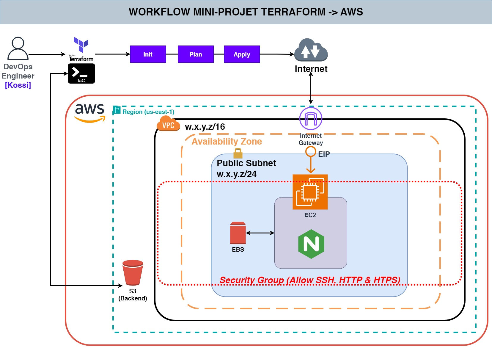
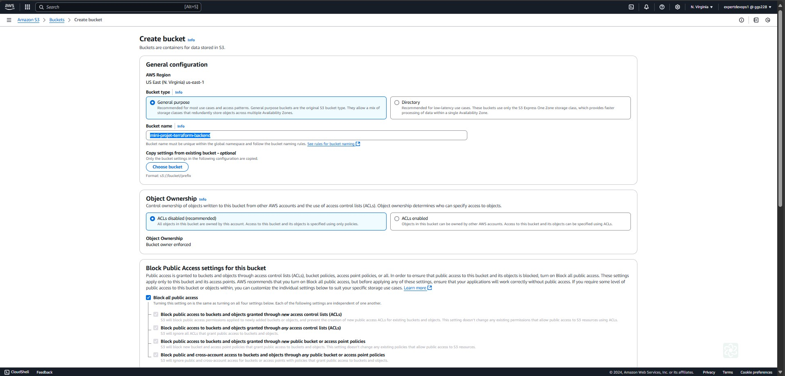

# MINI-PROJET-TERRAFORM : Déployez une infra complète

## INFORMATIONS A PROPOS DE L'AUTEUR

Session           : Bootcamp DevOps N°15

Period            : September - November

First & Last Name : Kossi GBENOU

LinkedIn          : https://www.linkedin.com/in/gkossi/


## ENONCE


L'énoncé du présent projet se présente comme suit :

> ![00 :: Enoncé du projet] 


## PREREQUIS & WORKFLOW

Pour réaliser ce projet, il faut tout d'abord identifier les prérequis et aussi construire un worklow. Cette étape est illustrée sur l'image suivante  :

> ![01 :: PREREQUIS & WORKFLOW] 
<!--div align="center">
	<p>
<a href="https://www.terraform.io/" target="_blank"></a>
<a href="https://aws.amazon.com/fr/" target="_blank"></a>
</p>
</div-->

## METHODLOGIE ET BONNES PRATIQUES
Dans la réalisation de tout projet, il est nécessaire d'adopter une méthologie à laquelle il est aussi important d'associer des bonnes pratiques. Dans le cadre de ce projet, voici notre méthodologie ainsi que les bonnes pratiques associées :

1. Nous allons stocker le state file de l'infra sur un remote backend (S3) ;
2. Nous allons utiliser un compte IAM avec les droits Admin sur AWS ;
3. Nous allons fournir les paramètres (***ACCESS KEY*** et ***SECRET KEY***) d'accès au compte à partir du paramètre ***shared_credentials_files*** ;
3. Nous allons fournir la paire de clé (***PRIVATE_KEY***) permettant de se connecter à l'infra à partir du protocole SSH en utilisant la fonction ***file*** ;
4. Les dossiers du projet seront organisés de la facon suivantes :
	- Le dossier **modules**: comme son nom l'indique, c'est lui qui va contenir nos différents modules (EC2, EBS, EIP, SG) ;
	- Le dossier **app**: va représenter notre principale infra à provisionner. Il va contenir le manifest principal où seront appelés nos différents modules ;
	- Le dossier **images**: va servir à stocker les différentes catpures d'écran des réalisations;
	- Le fichier **.gitignore**: va contenir les infos sur les répertoires et fichiers à ignorer lors du Push du projet sur notre SCM;
	- Le fichier **infos_ec2.txt**: va servir à enregistrer certaines infos utiles de notre infra comme : PUBLIC IP, ID et AZ.

## PLAN DE TRAVAIL :  LES OPERATIONS A EFFECTUEES
1. Etape N°1 : Pour commencer, nous allons d'abord créer le bucket S3 ;
2. Etape N°2 : Créer les différents modules (EC2, EBS, EIP, SG) qui vont permettre de provisionner une infra complète. Pour se faire, nous allons procéder comme suit :
	- Créer un répertoire nommé ***modules*** à la racine du projet et y créer à l'intérieur un sous-répertoire pour chacun des module ***ec2***, ***ebs***, ***eip*** et ***sg*** qui vont contenir les fichiers manifests ;
	- Créer dans chacun des sous-répertoires les fichiers suivants :

	```bash
	├── ec2                ├── ebs                ├── eip                ├── sg
	│   ├── main.tf        │   ├── main.tf        │   ├── main.tf        │   ├── main.tf
	│   ├── outputs.tf     │   ├── outputs.tf     │   ├── outputs.tf     │   ├── outputs.tf
	│   └── variables.tf   │   └── variables.tf   │   └── variables.tf   │   └── variables.tf
	```

	- ***variables.tf*** : va servir à variabiliser les éléments nécessaires notamment le type d'instance, le tag et le groupe de securité ;
	- ***main.tf*** : va contenir l'ensemble des éléments non sensibles notamment le data source, l'instance EC2, le volume EBS, le groupe de sécurité et l'adresse ip publique ;
	- ***outputs.tf*** : va servir à rendre accessibles certaines valeurs à utiliser par d'autres modules
3. Etape N°3 : Créer l'environnement (APP) à provisionner :
	- Créer un répertoire nommé ***app*** à la racine du projet qui va contenir les fichiers manifests ;
	- Créer à l'intérieur du répertoire ***app***, un fichier ***main.tf*** qui va contenir l'ensemble des éléments sensibles (le provider aws et le backend S3) et non sensibles (l'appel du module EC2).

## REALISATIONS ETAPE PAR ETAPE

### Etape N°1 : Création du bucket S3
Comme prévu dans notre plan de travail, on va commencer par créer le buckect S3 qui va servir à stocker le state file de notre projet.

```bash
Amazon S3 -> Create bucket
```

> ![Création du bucket S3] 

> ![Création du bucket S3 (Suite)] 

### Etape N°2 : Création des modules
<!--div>
Création des dossiers et fichiers :
mkdir -p mini-projet-terraform && cd mini-projet-terraform 
mkdir -p app modules/{ec2,eip,ebs,sg}
</div-->

#
1. **Module EC2 :**
#
Ce module permet de déployer une machine virtuelle EC2.
Le contenu des trois (03) fichiers de ce module se présentent comme suit :

- Le fichier ***variables.tf*** :

```bash
variable "ec2_instance_type" {
  type        = string
  default     = "t2.micro"
  description = "Configuration du type d'instance AWS"
}

variable "ec2_user" {
  type = string
  default = "ubuntu"
  description = "L'utilisateur configuré pour l'instance EC2"
}

variable "ec2_common_tag" {
  type = map(string)
  default = {
    Name = "ec2-mini-projet-terraform"
  }
  description = "Le tag sur l'instance ec2"
}

variable "ec2_key_name" {
  type    = string
  default = "expertdevops"
  description = "La paire de clé de l'instance EC2"
}

variable "aws_sg" {
  type        = string
  default     = "mini-projet-terraform-sg"
  description = "Le groupe de sécurité"
}
```

- Le fichier ***main.tf*** :

```bash
# Obtenir dynamiquement la dernière version de ubuntu bionic
data "aws_ami" "ubuntu_bionic" {
  most_recent = true
  owners      = ["099720109477"] # ID du propriétaire officiel des AMIs Ubuntu dans AWS

  filter {
    name   = "name"
    values = ["ubuntu/images/hvm-ssd/ubuntu-bionic-18.04-amd64-server-*"]
  }
  filter {
    name   = "virtualization-type"
    values = ["hvm"]
  }
}

# Définition de l'instance EC2 à déployer
resource "aws_instance" "myec2" {
  ami             = data.aws_ami.ubuntu_bionic.id
  instance_type   = var.ec2_instance_type
  tags            = var.ec2_common_tag
  key_name        = var.ec2_key_name
  security_groups = ["${var.aws_sg}"]

  # Connexion à la VM et installation de nginx
  provisioner "remote-exec" {
    inline = [
      "sudo apt install -y nginx && sudo systemctl enable nginx && sudo systemctl start nginx",
      "sudo echo <center><h1>Hello Eazytraining !!!</h1><h2>Bienvenue dans le Mini-Projet Terraform réalisé par Kossi GBENOU !</h2></center> > /usr/share/nginx/html/index.html"
    ]

    connection {
      type        = "ssh"
      user        = var.ec2_user
      private_key = file("C:/Users/BORIS/Downloads/${var.ec2_key_name}.pem")
      host        = self.public_ip
    }
  }

  # Enregistrement des informations (ip publique, ID et AZ) de la VM dans un fichier en local sur mon PC
  provisioner "local-exec" {
    command = "echo PUBLIC IP: ${self.public_ip}; ID: ${aws_instance.myec2.id}; AZ: ${aws_instance.myec2.availability_zone} > infos_ec2.txt"
  }

  # Supression automatique des volumes supplémentaires associés à notre VM
  root_block_device {
    delete_on_termination = true
  }

}
```

- Le fichier ***outputs.tf*** :

```bash
output "ec2_id" {
  value = aws_instance.myec2.id
}

output "ec2_az" {
  value = aws_instance.myec2.availability_zone
}
```

#
2. **Module EBS :**
#
Ce module permet de déployer un volume EBS à associer à notre machine virtuelle EC2.
Le contenu des trois (03) fichiers de ce module se présentent comme suit :

- Le fichier ***variables.tf*** :

```bash
variable "ebs_az" {
  type        = string
  default     = "us-east-1a"
  description = "La zone de disponibilité de l'EBS"
}

variable "ebs_common_tag" {
  type = map(string)
  default = {
    Name = "ebs-mini-projet-terraform"
  }
  description = "Le tag sur l'EBS"
}

variable "ebs_size" {
  type        = number
  default     = 10
  description = "La taille de l'EBS"
}
```

- Le fichier ***main.tf*** :

```bash
# Définition de l'EBS
resource "aws_ebs_volume" "myec2_ebs" {
  availability_zone = var.ebs_az
  tags              = var.ebs_common_tag
  size              = var.ebs_size
}
```

- Le fichier ***outputs.tf*** :

```bash
output "ec2_ebs_id" {
  value = aws_ebs_volume.myec2_ebs.id
}
```

#
3. **Module EIP :**
#
Ce module permet d'obtenir dynamiquement une adresse ip publique statique et de l'associer à notre machine virtuelle EC2.
Le contenu des trois (03) fichiers de ce module se présentent comme suit :

- Le fichier ***variables.tf*** :

```bash
variable "instance_id" {
  type        = string
  description = "ID de l'instance EC2 provenant du module EC2"
}

variable "eip_common_tag" {
  type = map(string)
  default = {
    Name = "eip-mini-projet-terraform"
  }
  description = "Le tag sur l'eip de l'instance ec2"
}
```

- Le fichier ***main.tf*** :

```bash
# Définition de l'adresse ip publique de notre VM EC2
resource "aws_eip" "ec2_public_ip" {
  instance = var.instance_id
  domain   = "vpc"
  tags = var.eip_common_tag
}
```

- Le fichier ***outputs.tf*** :

```bash
output "ec2_eip_id" {
  value = aws_eip.ec2_public_ip.id
}

output "ec2_eip" {
  value = aws_eip.ec2_public_ip.public_ip
}
```

#
4. **Module SG :**
#
Ce module permet de créer un groupe de sécurité et de l'associer à notre machine virtuelle EC2.
Le contenu des trois (03) fichiers de ce module se présentent comme suit :

- Le fichier ***variables.tf*** :

```bash
variable "sg_name" {
  type        = string
  default     = "allow_http_https_ssh"
  description = "Le nom du groupe de sécurité"
}

variable "sg_common_tag" {
  type        = map(string)
  default = {
    Name  = "sg-mini-projet-terraform"
  }
  description = "Le tag sur le groupe de sécurité"
}
```

- Le fichier ***main.tf*** :

```bash
# Définition du groupe de sécurité à appliquer à notre infrastructure
resource "aws_security_group" "mysg" {
  name        = var.sg_name
  tags        = var.sg_common_tag
  description = "Autorisation des trafiques entrants et sortants"

  # Règle pour autoriser le trafic entrant en HTTPS (port 443)
  ingress {
    description = "TLS from VPC"
    from_port   = 443
    to_port     = 443
    protocol    = "tcp"
    cidr_blocks = ["0.0.0.0/0"] # Permettre l'accès de partout
  }

  # Règle pour autoriser le trafic entrant en HTTP (port 80)
  ingress {
    description = "http from VPC"
    from_port   = 80
    to_port     = 80
    protocol    = "tcp"
    cidr_blocks = ["0.0.0.0/0"] # Permettre l'accès de partout
  }

  # Règle pour autoriser le trafic entrant en SSH (port 22)
  ingress {
    description = "ssh from VPC"
    from_port   = 22
    to_port     = 22
    protocol    = "tcp"
    cidr_blocks = ["0.0.0.0/0"] # Permettre l'accès de partout
  }

  # Règle pour autoriser tout type de trafic sortant de la VM
  egress {
    from_port   = 0
    to_port     = 0
    protocol    = "-1"
    cidr_blocks = ["0.0.0.0/0"] # Permettre l'accès de partout
  }
}
```

- Le fichier ***outputs.tf*** :

```bash
output "sg-name" {
  value = aws_security_group.mysg.name
}
```

### Etape N°3 : Création de l'environnement (APP) à provisionner : Utilisation des modules

Ici, il s'agira de la mise en place de notre infra principale.
Comme décrit précédemment, nous allons créer un répertoire nommé ***app*** à la racine du projet qui va contenir les fichiers manifests (***variables.tf*** et ***main.tf***) ainsi que le fichier ***infos_ec2.txt***.
Le contenu des fichiers se présente comme suit :

- Le fichier ***variables.tf*** :

```bash

```

- Le fichier ***main.tf*** :

Il va contenir l'ensemble des éléments sensibles (le provider aws et le backend S3) et non sensibles (l'appel du module EC2).

```bash

```

- Le fichier ***infos_ec2.txt*** :

```bash

```